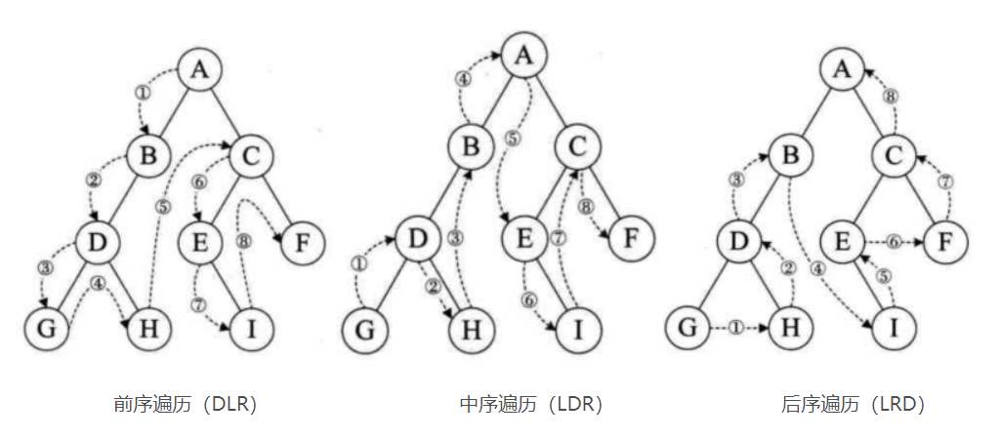

# 二叉树(`com.py7hon.tree.binary`)

>   前序中序后序遍历

单元测试数据：



前序遍历：

```java
public static <T> ArrayList<BinaryTreeNode<T>> preOrder(BinaryTreeNode<T> node) {
    ArrayList<BinaryTreeNode<T>> result = new ArrayList<>();
    if (node == null) {
        return result;
    }

    result.add(node);
    result.addAll(preOrder(node.getLeft()));
    result.addAll(preOrder(node.getRight()));

    return result;
}
```

